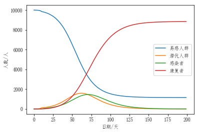
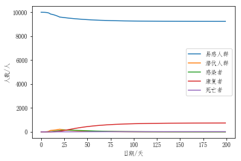

# 2019-nCoV感染动力学分析及防护的必要性

Author：Hehao

data：2020-02-05

tools：python

## 1.前言

2019岁末，当大家还在热火朝八卦故宫开大G新闻时，突如其来的新型冠状病毒2019-nCoV抢走了热搜，改变了这个春节，也改变了全中国人的生活节奏。为了自己安全，也为了不给社会添乱，这些天一直很自觉的居家隔离，关注着疫情发展，通过校友会渠道捐了善款，闲时在微信群做科普、辟谣言，尽自己所能，有一份力尽一份力吧。

昨天在B站上看到一个视频讲的运用流行病学模型解释此次新冠病毒传播机理，很有意思，极大地激发了我对研究它的兴趣。隔离闲着也是闲着，于是乎我写点代码跑了几组对照试验，记录下了这次研究过程，权当是学习。

## 2.病毒传播的动力学分析

通过对传染病传播进行数学建模，研究传染病的传播速度、空间范围、传播途径、动力学机理等问题，以指导对传染病的有效地预防和控制。查阅维基百科，常见的传染病模型按照传染病类型分为 SI、SIR、SIRS、SEIR 模型等。按照传播机理又分为基于常微分方程、偏微分方程、网络动力学的不同类型。

### 2.1传染模型的基本假设

通常，把病毒传染空间范围内的人群分为如下4类：

* S类（Susceptible），易感者，指的是未被传染的健康者，但缺乏免疫力，与感染者接触后容易被感染；

* E类（Exposed），暴露者，指接触过感染者，但暂时无能力传染他人，适用于潜伏期长的病毒；

* I类（Infectious），感染者，指已经确诊的感染人群，可以传染S类人群将其变为E类或者I类群体；

* R类（Recovered），康复者，指因隔离或痊愈后有免疫力的人群。


### 2.2 SEIR模型对本次病毒传染分析

根据此次新型冠状病毒传播感染的特点，选择SEIR模型进行传播感染分析。按照SEIR模型，将人群分为易感者S，暴露者E（以下称为潜伏者），感染者I，康复者R，四类人群的人数分别为S、E、I、R。

易感者S一开始先成为潜伏者E经历一段潜伏期，一段时间之后才会成为感染者I，感染者I被发现后经治疗或依靠自身免疫成为康复者R。

假设一个地区总人数为N，I个感染者如不隔离，每人每天会碰到r个人，以概率$\beta$传染这r个人；潜伏者E会有概率$\alpha$成为感染者；同时感染者因治疗或免疫有$\gamma$的概率成为康复者R，可以建立如下方程组:
$$
\left\{ 
\begin{array}{c}
\frac{dS}{dt}=-\frac{r \beta I S}{N} \\
\frac{dE}{dt}=\frac{r \beta I S}{N}-aE \\
\frac{dI}{dt}=aE-\gamma I \\
\frac{dR}{dt}=\gamma I \\
N = S+E+I+R
\end{array}
\right.  
$$
上述方程组没有解析解，但是可以利用计算机软件得到其数值解。我们假设一个地区总人数N=10000，最开始有一个感染者，没有潜伏者，没有康复者，即:
$I_0=1,E_0=0,R_0=0,S_0=9999$


```python
import numpy as np
import matplotlib.pyplot as plt
from pylab import mpl
mpl.rcParams['font.sans-serif']=['FangSong']
mpl.rcParams['axes.unicode_minus']=False
```


```python
def SEIR(seir,para,steps):
    S,E,I,R = seir
    r,beta,alpha,gamma,N = para 
    dS = -(r*beta*I*S)/N
    dE =  (r*beta*I*S)/N - alpha*E
    dI = alpha*E - gamma*I
    dR = gamma*I
    return [S+dS*steps, E+dE*steps, I+dI*steps, R+dR*steps]
```


```python
def SEIR_II(seir,para,steps):
    S,E,I,R = seir
    r,r2,beta,beta2,a,gamma,N = para    
    dS = -(r*beta*I*S)/N - (r2*beta2*E*S)/N
    dE =  (r*beta*I*S)/N - a*E + (r2*beta2*E*S)/N
    dI = a*E - gamma*I
    dR = gamma*I
    return [S+dS*steps, E+dE*steps, I+dI*steps, R+dR*steps]
```


```python
"""
func:模型
seri:模型的SERI群体
para:模型参数
intervene_N：第N天进行干预戒严
"""
def calculate(func,seri,para,intervene_N):
    steps = 1
    t = np.arange(0,200,steps)
    res=[]
    for itm in t:
        if intervene_N!=0:
            if itm>intervene_N:
                para[0]=4
                para[1]=4
        seri=func(seri,para,steps)
        res.append(seri)
    return np.array(res)
```


```python
def plot_1graph(np_res):
    plt.figure()
    plt.plot(np_res[:,0])
    plt.plot(np_res[:,1])
    plt.plot(np_res[:,2])
    plt.plot(np_res[:,3])
    plt.legend(['易感人群','潜伏人群','感染者','康复者'])
    plt.xlabel("日期/天")
    plt.ylabel("人数/人")
    plt.show()
```

### 2.2.1 参照试验


```python
"""
参数修改区
"""
steps = 1
seri0 = [9999, #S
         0,    #E
         1,    #I
         0]    #R
seri = seri0
para = [20,     # I每天接触的人  r
        0.03,   # S和E被感染的概率  beta
        0.1,    # 潜伏者变为感染者的概率 alpha
        0.1,    # 康复/治愈概率  gamma
        10000]  # 总人数
```


```python
res = calculate(SEIR,seri,para,0)
plot_1graph(res)
```


上述参照试验，感染者若不加隔离每天出去接触20个人，S和E被感染的概率$\beta$为0.03，潜伏者变为感染者的概率$\alpha$为0.1，可以看到随时间推移，潜伏者（也即疑似病例）会先达到顶峰，之后随着潜伏者发病成为感染者，感染者后达到增长拐点，随着治疗和自身免疫，潜伏者和感染者人数降低，康复者人数增加。

### 2.2.2对照试验一（戴口罩）

我们知道，戴口罩可以有效降低被感染的概率，假设戴口罩可以降低1/2感染率，将参数$\beta$由0.03改为0.015运行程序


```python
"""
参数修改区
"""
steps = 1
seri0 = [9999, #S
         0,    #E
         1,    #I
         0]    #R
seri = seri0
para = [20,     # I每天接触的人  r
        0.015,   # S和E被感染的概率  beta
        0.1,    # 潜伏者变为感染者的概率 alpha
        0.1,    # 康复/治愈概率  gamma
        10000]  # 总人数

res = calculate(SEIR,seri,para,0)
plot_1graph(res)
```


**结论**

从上述曲线可以看出，相同情况下出门戴口罩，潜伏者和感染者增量及增速被大大抑制。敲黑板！！！出门戴口罩为自己，为大家，为国家。

### 2.2.3对照试验二（居家隔离）

如果坚持不出门，实施居家隔离，把参数r由20设置为3，再次运行代码进行仿真


```python
"""
参数修改区
"""
steps = 1
seri0 = [9999, #S
         0,    #E
         1,    #I
         0]    #R
seri = seri0
para = [3,     # I每天接触的人  r
        0.03,   # S和E被感染的概率  beta
        0.1,    # 潜伏者变为感染者的概率 alpha
        0.1,    # 康复/治愈概率  gamma
        10000]  # 总人数
```


```python
res = calculate(SEIR,seri,para,0)
plot_1graph(res)
```


**结论**

真是<font color=blue>Amazing</font>啊！！！感染者和潜伏者几乎没了。敲黑板！！！居家隔离不出门是打赢疫情防控阻击战决胜因素，听钟院士的话，告诉你的家人朋友，不出门就是为国家做贡献。

### 2.3 改进后的SEIR模型

事实上，我们知道本次新型冠状病毒在潜伏期具有传染性，因此需要将潜伏者的传染性也要考虑进去。假设潜伏者以概率$\beta_2$将易感者S感染成新的潜伏者，潜伏者每天接触的人数为$r_2$，对模型进行改进，建立传染模型方程组：
$$
\left\{ 
\begin{array}{c}
\frac{dS}{dt}=-\frac{r \beta I S}{N}-\frac{r_2 \beta_2 E S}{N} \\
\frac{dE}{dt}=\frac{r \beta I S}{N}-aE+\frac{r_2 \beta_2 E S}{N} \\
\frac{dI}{dt}=aE-\gamma I \\
\frac{dR}{dt}=\gamma I \\
N = S+E+I+R
\end{array}
\right.
$$
### 2.3.1参照试验

对加入潜伏者传染这一因素后，假设潜伏者每天接触人数$r_2=20$，潜伏者传染易感者的概率$\beta_2=0.03$,其他条件保持不变，运行程序


```python
steps = 1
seri0 = [9999, #S
         0,    #E
         1,    #I
         0]    #R

seri = seri0
paraII = [20,     # 感染者每天接触的人  r
          20,     # 潜伏者每天接触的人  r2
          0.03,   # 感染者传染的概率  beta
          0.03,  # 潜伏者传染的概率  beta2
          0.1,    # 潜伏者变为感染者的概率 a
          0.1,    # 康复/治愈概率  gamma
          10000]

res = calculate(SEIR_II,seri,paraII,0)
plot_1graph(res)
```


**结论**

对比2.2.1的参照试验，发现潜伏者一旦具有传染性之后，潜伏(疑似)和感染者(确诊)会以很快的速度提前爆发，忒可怕了-_-///

### 2.3.2 对照试验（封城停运戒严）

2.3.1的参照试验我们可以看出在第12-25天左右潜伏者（疑似）和感染者（确诊）开始爆发，如果我们根据模型提前知道这一事实，可以实施封城封村，交通停运，就可以提前遏制潜伏者和感染者的数量，假设我们在第10天开始戒严防控，即潜伏者和感染者活动范围小了，假设接触人由20设为4，修改程序仿真：


```python
res = calculate(SEIR_II,seri,paraII,10)
plot_1graph(res)
```





**结论**

对比2.3.1的参照试验，可以看到潜伏者和感染者爆发的时间由第12-25天推迟到第120天，这为医务人员和药企赢得了宝贵的时间，而且感染人数和潜伏人数也降低了一半，大大降低了医疗卫生资源的消耗使用。村长挖断路设路障不让你出不让人进，那是保护全村人，为村长点赞！

### 2.4 扩展SEIR引入死亡者D的分析(Feb.15，2020)

前段时间Preprint Server for Biology网站[bioRxiv](https://www.biorxiv.org/)上传了一篇paper[Beware of asymptomatic transmission: Study on 2019-nCoV prevention and control measures based on extended SEIR model](https://www.biorxiv.org/content/10.1101/2020.01.28.923169v1)，受此启发，对2.3节模型进行扩展性探索，在SEIR模型基础之上引入死亡者D进行建模分析，称之为SEIRD模型。

SEIRD模型中，我们假设感染人群I有两种情况，一类是未治疗未隔离以$\psi$的概率死亡成为D群体，显然另一类则是以$(1-\psi)$的概率康复成为R群体,因此对2.3节引入死亡者D的传播动力学模型为：
$$
\left\{ 
\begin{array}{c}
\frac{dS}{dt}=-\frac{r \beta I S}{N}-\frac{r_2 \beta_2 E S}{N} \\
\frac{dE}{dt}=\frac{r \beta I S}{N}-aE+\frac{r_2 \beta_2 E S}{N} \\
\frac{dI}{dt}=aE-\gamma I \\
\frac{dR}{dt}=(1-\psi) \gamma I \\
\frac{dD}{dt}=\psi \gamma I\\
N = S+E+I+R+D
\end{array}
\right.
$$

```python
def SEIRD(seird,para,steps):
    S,E,I,R,D= seird
    r,r2,beta,beta2,a,gamma,psi,N = para    
    dS = -(r*beta*I*S)/N - (r2*beta2*E*S)/N
    dE =  (r*beta*I*S)/N - a*E + (r2*beta2*E*S)/N
    dI = a*E - gamma*I
    dR = (1-psi)*gamma*I
    dD = psi*gamma*I
    return [S+dS*steps, E+dE*steps, I+dI*steps, R+dR*steps, D+dD*steps]
```


```python
def plot_2graph(np_res):
    plt.figure()
    plt.plot(np_res[:,0])
    plt.plot(np_res[:,1])
    plt.plot(np_res[:,2])
    plt.plot(np_res[:,3])
    plt.plot(np_res[:,4])
    plt.legend(['易感人群','潜伏人群','感染者','康复者','死亡者'])
    plt.xlabel("日期/天")
    plt.ylabel("人数/人")
    plt.show()
```

### 2.4.1 参照试验

假设被感染群体I未接受治疗的死亡率$f_1=0.1$，接受治疗后的死亡率$f_1=0.0201$为[引自中国医疗网，全国死亡率2.01%](http://med.china.com.cn/content/pid/159483/tid/1026)，其他条件与2.3.1节保持一致，运行代码


```python
steps = 1
serid0 = [9999, #S
         0,    #E
         1,    #I
         0,    #R
         0]    #D

serid = serid0
paraIII = [20,     # 感染者每天接触的人  r
          20,     # 潜伏者每天接触的人  r2
          0.03,   # 感染者传染的概率  beta
          0.03,  # 潜伏者传染的概率  beta2
          0.1,    # 潜伏者变为感染者的概率 a
          0.1,    # 康复/治愈概率  gamma
          0.1,   # 感染者的死亡率  psi
          10000]
"""
func:模型
seri:模型的SERI群体
para:模型参数
intervene_N：第N天进行干预戒严
receive_Treat_N
"""
def calculateII(func,serid,para,intervene_N,receive_Treat_N):
    steps = 1
    t = np.arange(0,200,steps)
    res=[]
    for itm in t:
        if intervene_N!=0:
            if itm>intervene_N:
                para[0]=4  #封城后接触人人数降低
                para[1]=4
        if receive_Treat_N!=0:
            if itm>receive_Treat_N:
                para[0]=1  #隔离收治后接触人数继续降低
                para[1]=1
                para[6]=0.0201 #隔离收治治疗后死亡率降低
        serid=func(serid,para,steps)
        res.append(serid)
    return np.array(res)

res = calculateII(SEIRD,serid,paraIII,0,0)
plot_2graph(res)
print("最终的死亡人数为{0}：".format(res[199,4]))
```


    最终的死亡人数为999.9995058341118：


【结论】：打印第199天的死亡人数可以看到，如果不加隔离和不加治疗，10000人最终会死亡1000人，这个结果是非常令人震惊的。

### 2.4.2 对照试验一（封城措施）

本组对照试验同2.3.2节保持一致,但未经治疗，再来分析死亡情况


```python
steps = 1
serid0 = [9999, #S
         0,    #E
         1,    #I
         0,    #R
         0]    #D

serid = serid0
paraIII = [20,     # 感染者每天接触的人  r
          20,     # 潜伏者每天接触的人  r2
          0.03,   # 感染者传染的概率  beta
          0.03,  # 潜伏者传染的概率  beta2
          0.1,    # 潜伏者变为感染者的概率 a
          0.1,    # 康复/治愈概率  gamma
          0.1,   # 感染者的死亡率  psi
          10000]

res = calculateII(SEIRD,serid,paraIII,10,0)
plot_2graph(res)
print("最终的死亡人数为{0}：".format(res[199,4]))
```


    最终的死亡人数为884.1414755495692：


【结论】大体结论同2.3.2节一致，但同2.4.1节参照试验对比后发现，虽未经治疗，但死亡人数得到了一定控制

### 2.4.3对照试验二（封城隔离+收治治疗）

在2.4.2节基础上，即第10天封城，第40天、第20天分别对所有感染者全部感染者收治进行隔离治疗，做几组对比试验


```python
steps = 1
serid0 = [9999, #S
         0,    #E
         1,    #I
         0,    #R
         0]    #D

serid = serid0
paraIII = [20,     # 感染者每天接触的人  r
          20,     # 潜伏者每天接触的人  r2
          0.03,   # 感染者传染的概率  beta
          0.03,  # 潜伏者传染的概率  beta2
          0.1,    # 潜伏者变为感染者的概率 a
          0.1,    # 康复/治愈概率  gamma
          0.1,   # 感染者的死亡率  psi
          10000]

res = calculateII(SEIRD,serid,paraIII,10,40)
plot_2graph(res)
print("第40天收治隔离，最终的死亡人数为{0}：".format(res[199,4]))
```


    第40天收治隔离，最终的死亡人数为105.37464197718452：


```python
steps = 1
serid0 = [9999, #S
         0,    #E
         1,    #I
         0,    #R
         0]    #D

serid = serid0
paraIII = [20,     # 感染者每天接触的人  r
          20,     # 潜伏者每天接触的人  r2
          0.03,   # 感染者传染的概率  beta
          0.03,  # 潜伏者传染的概率  beta2
          0.1,    # 潜伏者变为感染者的概率 a
          0.1,    # 康复/治愈概率  gamma
          0.1,   # 感染者的死亡率  psi
          10000]
res = calculateII(SEIRD,serid,paraIII,10,20)
plot_2graph(res)
print("第20天收治隔离，最终的死亡人数为{0}：".format(res[199,4]))

```





    第20天收治隔离，最终的死亡人数为20.532262158672083：


【结论】本节对照2.4.2节试验发现，**收治隔离治疗**可以大大降低死亡人数；本节两组对比试验也可以发现，**尽早的收治隔离治疗**能够进一步控制死亡人数降低。对此我们向一线的医疗人员致敬，向争分夺秒赶工期修建临时医院的工程师工人们致敬！

## 3.结论

在SEIR基本模型的假设下增加了两组对比试验，戴口罩和居家隔离，试验证明戴口罩可以有效降低疫情传播和感染人群的数量增长，居家隔离就更厉害了，只要跟家窝着不出门，病毒总会有消失的那一天。在SEIR模型之上加入潜入者传染这一特点，与SEIR基础模型作对比试验，实验证明由于潜伏者具有传染性，病毒的传播和爆发会提前，感染人数也更多，在此之上增加一组对照试验，即封城封村限制潜伏人群和感染人群的活动范围，实验结果表明村长这一举措真是<font color=red>very well</font>啊，不仅推迟了爆发期为药企和医务人员争取时间进行药物研发和治疗研究。

<font color=red>[Feb.15,2020 added]</font>2.4节中对模型引入了死亡者D进行不同情景下的对比实验。分析结果表明，如不加治疗不加隔离，最终死亡者人数会以未经治疗的死亡率收敛。如果提前进行封城措施缩小人员活动范围，死亡人数得到一定控制，如果再加以隔离治疗，死亡人数会大大降低，越早收治，死亡人数会越少。

**最后声明：** 本着科普和趣味，本文只是从流行病学传播机理理论上对本次新型冠状病毒进行仿真分析，对本次新型冠状病毒病毒不具有最终指导意义，事实上每一种传染病都有它独有的特性和模型参数，这需要专家大量工作和调研结果来支撑。

## 4.参考资料

[1] https://baike.baidu.com/item/%E4%BC%A0%E6%9F%93%E7%97%85%E6%A8%A1%E5%9E%8B/5130035?fr=aladdin#3

[2] https://en.wikipedia.org/wiki/Compartmental_models_in_epidemiology

